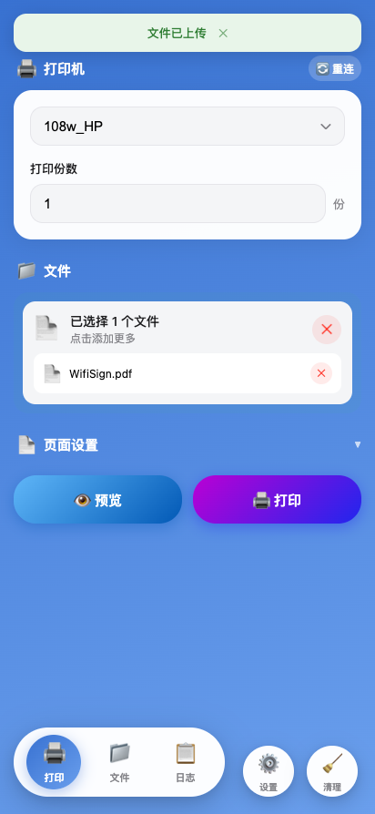
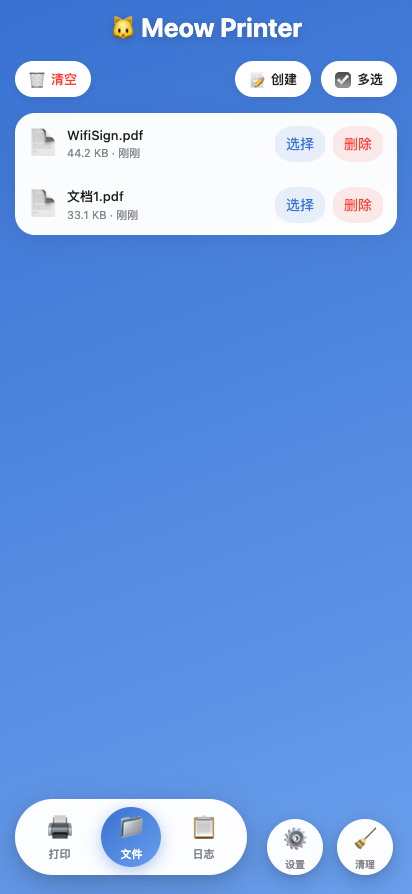
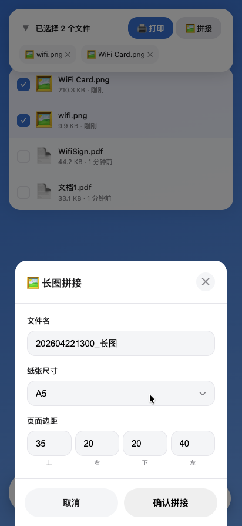
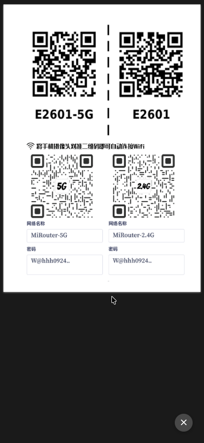
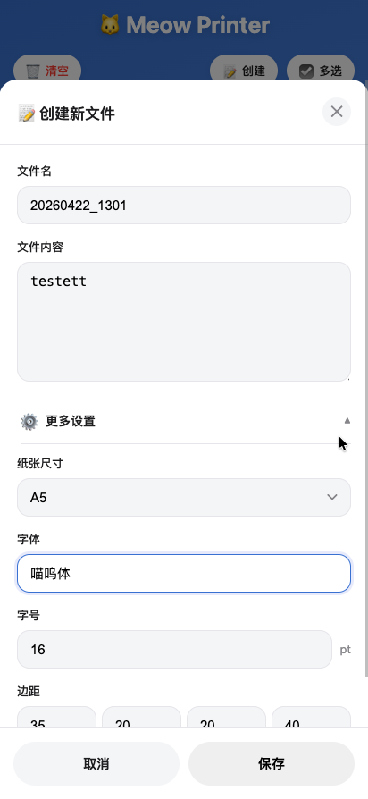

# Meow Printer 打印喵

🌐 局域网打印机控制服务，通过 Web 界面上传文件并发送到 CUPS 打印机打印。支持移动端适配，随时随地打印文件。

## 特性

- **移动端适配**: 专为手机和平板优化的卡片式界面，随时随地打印
- **中文支持**: 完整的 UTF-8 locale 支持，中文文件名无乱码
- **多格式支持**: PDF、JPG、PNG...
- **文本创建**: 内置文本编辑器，支持创建纯文本文件并生成 PDF
- **长图拼接**: 多张图片按顺序拼接，自动按纸张尺寸分页生成 PDF
- **N-up 打印**: 每张纸打印 2、4、6、9 页
- **自定义页面范围**: 支持指定页面（如 1,3,5-10）
- **页码显示**: 预览和打印时可在页面底部添加页码，n-up 模式下在每页显示原文件页码（如 1/3）
- **页面缩放**: 适应页面或自定义百分比（10%-200%滑块）
- **方向模式**: 支持纵向和横向
- **字体管理**: 自动检测字体目录中的字体
- **历史文件**: 上传过的文件自动保存，随时重新打印
- **日志查看**: 实时查看应用运行日志

## 预览











## 快速开始

### 开发模式

```bash
npm install
npm start
```

访问 http://localhost:3000

### Docker 部署

```bash
docker-compose up -d
```

## 项目结构

```
meow-printer/
├── src/
│   ├── app.js           # Express 服务入口
│   ├── config/          # 配置目录
│   │   ├── config.js    # 后端配置
│   │   └── global.js    # 全局共享配置
│   ├── controller/      # 控制器
│   ├── service/         # 服务层 (cups.js, pdf.js)
│   ├── utils/           # 工具函数
│   └── web/             # 前端视图 (index.html, old.html)
├── public/
│   ├── cache/           # 缓存目录
│   ├── fonts/           # 字体目录
│   ├── uploads/          # 上传目录
│   └── utils/            # 前端工具
├── logs/                 # 日志目录
├── docker-compose.yml
├── Dockerfile
└── README.md
```

## 配置说明

### 目录说明

- `public/` - 静态资源目录（缓存、字体、上传文件）
- `logs/` - 日志文件目录

## API 接口

| 方法 | 路径 | 说明 |
|------|------|------|
| GET | /api/printers | 获取打印机列表 |
| POST | /api/print | 提交打印任务 |
| GET | /api/jobs | 获取打印任务列表 |
| DELETE | /api/jobs/:id | 取消打印任务 |
| GET | /api/fonts | 获取可用字体 |
| POST | /api/files | 上传文件 |
| POST | /api/textfile | 创建文本文件 |
| GET | /api/history | 获取历史文件 |
| DELETE | /api/history/:name | 删除历史文件 |
| GET | /api/logs | 获取日志列表 |
| GET | /api/settings | 获取设置 |
| POST | /api/settings | 保存设置 |

## 部署说明

### 前置要求

本应用为局域网打印机控制服务，部署前需要：

1. **CUPS 服务器** - 局域网内已部署并配置好打印机的 CUPS 服务器
2. **网络互通** - 部署机器与 CUPS 服务器网络相通

### Docker 部署

```bash
docker run -d \
  --name meow-printer \
  -p 3000:3000 \
  -e CUPS_HOST=192.168.10.1 \
  -e CUPS_PORT=631 \
  -e CUPS_USER=admin \
  -e CUPS_PWD=123456 \
  -e TZ=Asia/Shanghai \
  scientistpun/meow-printer:latest
```

### 环境变量配置

| 变量 | 默认值 | 说明 |
|------|--------|------|
| CUPS_HOST | 192.168.10.1 | CUPS 服务器地址 |
| CUPS_PORT | 631 | CUPS 服务器端口 |
| CUPS_USER | admin | CUPS 用户名 |
| CUPS_PWD | 123456 | CUPS 密码 |
| DEV | false | 调试模式 |
| TZ | Asia/Shanghai | 时区 |

## 历史变更

### v2.4.3 (2026-04-27)
- 修复横排打印重复处理方向导致无效的问题

### v2.4.2 (2026-04-25)
- 修复打印 A4 纸时没有 A4 大小的问题

### v2.4.0 (2026-04-17)
- 修复 CUPS 重启功能 CSRF 保护问题，改用系统命令直接重启服务
- 新增多选文件列表折叠功能，提升 UI 体验
- 优化代码结构，移除无用参数

### v2.3.1 (2026-04-07)
- 修复长图拼接 PDF 嵌入单位混用问题
- 修复 sharp.extract 像素参数取整
- 添加 UI 点击动画特效

### v2.3.0 (2026-04-06)
- 整合长图拼接功能，简化 API 调用

### v2.2.1 (2026-04-06)
- 修复长图拼接边距单位不统一的问题

### v2.2.0 (2026-04-06)
- 新增长图拼接功能：多张图片自动拼接并分页生成 PDF

### v2.1.6

## License

MIT
